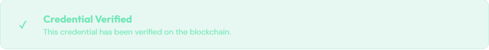

# 🚀 CREDBLOCK

### Verified credentials, privacy control, and instant trust on Algorand

---

  <strong>Issue, claim, share, and verify academic credentials with blockchain trust and student control.</strong> 
  Fake credentials are blocked instantly, and students keep privacy through claim acceptance.

  🌐 <strong>Live Demo:</strong> https://credblock.vercel.app 
  ⚠️ <strong>Status:</strong> Beta Version

## 🎥 Walkthrough Video

Watch the complete walkthrough of Credblock: https://youtu.be/N-o0hUY5c0w?si=FJk29mFmpBvSyF8e

---

## 🎯 What is Credblock?

Credblock is an academic credential platform that combines:

- Algorand NFT credential issuance,
- IPFS certificate metadata storage,
- and trusted verification using Credblock’s backend database.

Credblock stores every issued credential record in its database, so shared credentials can be verified instantly. If a credential was never issued through Credblock, it is rejected as **NOT VERIFIED** immediately.

### The Problem ❌

- Fake diplomas and unverifiable certificates
- Slow company/organization verification processes
- Paper credentials that are lost, altered, or forged
- Students forced to accept credentials without consent

### The Solution ✅

- Credentials are minted as **ARC-3 NFTs** on Algorand
- Issuers register and save issued credential records in Credblock’s database
- Students choose whether to accept or decline credential claims
- Issuers can revoke or burn credentials to invalidate them
- Shared credentials are verified instantly against Credblock’s DB and the blockchain

---

## 💡 How Credblock Works

### Issuer Flow

1. **Register** as an issuer with a wallet (Lute supports message signing).
2. **Upload** a certificate file (PDF or image).
3. **Enter** student information and issuance details.
4. **Mint** the credential as an Algorand NFT.
5. **Store** the issued credential record in Credblock’s database.
6. **Send** a credential claim request to the student, who can then claim or decline it.
7. **Transfer** the credential to the student only after they accept the claim request.
8. **Revoke / Burn** the credential later if it should no longer be valid.

### Student Flow

1. **Receive** a credential claim request from the issuer.
2. **Preview** the credential details before accepting.
3. **Accept** the claim request so the issuer can transfer the credential to you.
4. **Claim** the credential by connecting your wallet.
5. **Own** the NFT in your wallet after accepting.
6. **Decline** the claim if you want to keep it private.
7. **Share** the verification link or QR code when needed.

> Note: Every transaction on Algorand requires TestNet ALGO in your wallet, which can be obtained from the Algorand TestNet faucet.

### Privacy and Control

- Students control whether a credential enters their wallet.
- If the student declines, Credblock does not force the credential into their wallet.
- Issuers can revoke or burn credentials to prevent future verification.
- Shared credentials are only valid if they were actually issued and stored by Credblock.

### Sharing and Verification

- The issuer mints the credential and stores its metadata on IPFS.
- Credblock also saves the issued credential record in its backend database.
- A credential claim request is sent to the student for review and action.
- When a verifier opens the link, Credblock checks:
  1. Is the credential present in Credblock’s DB?
  2. Is the issuer valid?
  3. Is the NFT valid on Algorand?
  4. Has it been revoked or burned?

- If the credential exists in the DB and passes the blockchain checks, the verifier sees a **verified** status message or badge (similar to the verified image shown in the app).

  

- If the credential is missing: **NOT VERIFIED**
- If the credential was revoked or burned: **REVOKED**

### Fake Credential Protection

Because Credblock stores every issued credential record, fake credentials are rejected instantly.

Example:

- Issuer issues credential `12345` and Credblock stores it in the DB.
- Student receives a claim request for `12345`.
- Verifier (company/org) scans the link → Credblock finds the record and returns ✅ VERIFIED with a verified status message.
- A forged credential `99999` is scanned → Credblock does not find it and returns ⚠️ NOT VERIFIED instantly.

### For Verifiers (Companies / Organizations)

1. **Scan** a QR code or click a link
2. **See** the verification result:
   - ✅ VERIFIED — Credential is valid
   - ❌ REVOKED — Credential was revoked or burned
   - ⚠️ INVALID — Credential not found

**No login required** to verify — anyone can check!

---

## ✨ Key Features

| Feature | Description |
|---------|------------|
| **NFT-Based** | Credentials as ARC-3 NFTs on Algorand |
| **Instant Verification** | Verify in seconds via QR or link |
| **Student Ownership** | Students own credentials forever |
| **IPFS Storage** | Certificates stored on decentralized IPFS |
| **Revocation Support** | Burn credentials when needed |
| **Multi-Network** | TestNet & MainNet support |
| **QR Codes** | Easy sharing and verification |
| **Wallet-Based** | No accounts — just connect wallet |

---

## 🛠️ Technology Stack

- **Blockchain:** Algorand (ARC-3 NFTs)
- **Storage:** IPFS (Pinata)
- **Frontend:** React + Vite + TypeScript + Tailwind
- **Backend:** Express + Prisma + PostgreSQL
- **Wallets:** Pera, Defly, Lute, Exodus

---

## 🔗 Quick Links

- 🌐 **Live App:** https://credblock.vercel.app
- 📖 **TestNet Faucet:** https://bank.testnet.algorand.network
- 🔑 **Get Lute Wallet:** https://lute Wallet

---

## 📱 Supported Wallets

| Wallet | Issuer Registration | Receiving Credentials |
|--------|-----------------|-------------------|
| **Lute** ✅ | Message Signing | Yes |
| **Pera** ✅ | — | Yes |
| **Defly** ✅ | — | Yes |
| **Exodus** ✅ | — | Yes |

> **Note:** Lute wallet is required for issuer registration (only wallet supporting message signing).

---

## 🤝 Get Started

### As an Issuer

1. Go to https://credblock.vercel.app
2. Connect your wallet (Lute required for registration)
3. Complete issuer verification
4. Start issuing credentials

### As a Student

1. Receive a credential claim request from your university
2. Connect your wallet
3. Claim or decline your credential

### As a Verifier

1. Scan a QR code or click a verification link
2. See instant result — no login needed!

---

  Built on Algorand • Credentials as ARC-3 NFTs • No middleman

